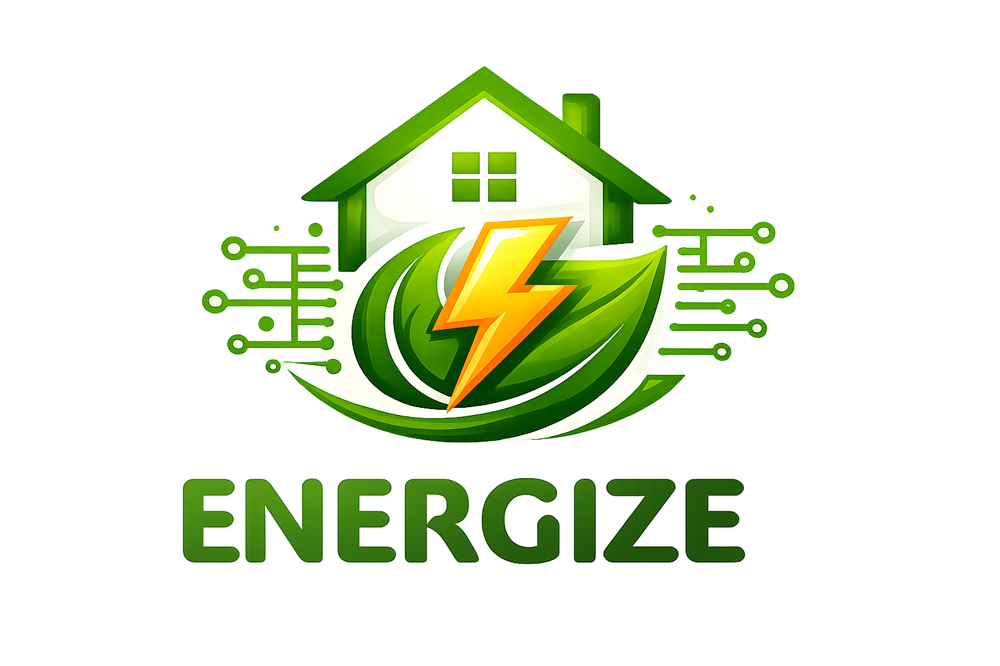

# ENERGIZE NILM Compression Pipeline

<p align="center">
  
</p>

<p align="center">
  <b>ENERGIZE Project</b> — DNN-based Non-Intrusive Load Monitoring Compression Pipeline
</p>

<p align="center">
  
  
  
  
</p>

---

## Overview

**ENERGIZE NILM Compression Pipeline** is the model compression and optimization codebase for appliance-level energy disaggregation developed within the **ENERGIZE** project. This repository is built upon the [ENERGIZE NILM Training Pipeline](https://github.com/sathanasoulias/ENERGIZE-NILM-Training-Pipeline) and focuses on compressing the trained models for deployment on edge devices.

Given a trained NILM model from the training pipeline, this codebase applies various compression techniques including pruning and quantization to reduce model size and computational requirements while maintaining performance. The final goal is to deploy optimized models on Edge Coral TPU devices for real-time inference.

The compression pipeline supports the same PyTorch architectures as the training pipeline:

| Model | Architecture | Strategy | Input Window |
|-------|-------------|----------|-------------|
| **CNN** | 1-D Convolutional Network | Seq2Point | 299 samples |
| **GRU** | Gated Recurrent Unit | Seq2Point | 199 samples |
| **TCN** | Temporal Convolutional Network | Seq2Seq | 600 samples |

---

## Compression Methods

This repository implements three main model compression techniques to optimize NILM models for edge deployment:

### Unstructured Pruning
Unstructured pruning removes individual weights from the model based on their magnitude, creating sparse models. This method uses PyTorch's built-in `torch.nn.utils.prune` module for global L1 weight pruning, which iteratively prunes the smallest weights across all layers.

### Structured Pruning
Structured pruning removes entire channels or neurons from convolutional layers, reducing the model architecture itself. This method uses the `torch_pruning` library for magnitude-based global channel pruning, which prunes channels based on their importance scores. Citation: [DepGraph: Towards Any Structural Pruning](https://arxiv.org/abs/2301.12900).

### Quantization (TFLite)
Quantization converts model weights and activations from floating-point to integer representations, significantly reducing model size and enabling faster inference. This pipeline uses TensorFlow Lite for full-integer INT8 quantization, optimized for deployment on Edge Coral TPU devices. The final goal is to deploy INT8-quantized models on edge hardware for real-time NILM inference.

Using this compression pipeline, we compress the models trained in the [ENERGIZE NILM Training Pipeline](https://github.com/sathanasoulias/ENERGIZE-NILM-Training-Pipeline) and evaluate the capabilities of the methods or combination of them.

---

The **PLEGMA** dataset is a Greek residential smart meter dataset recorded at **10-second** intervals. It covers multiple households and includes sub-metered appliance readings used as ground truth for NILM training and evaluation.

**Supported appliances**

| Appliance | Threshold | Cutoff |
|-----------|-----------|--------|
| `boiler` | 800 W | 4000 W |
| `ac_1` | 50 W | 2300 W |
| `washing_machine` | 15 W | 2600 W |

**House splits** — models are evaluated on fully unseen houses:

| Appliance | Train | Validation | Test |
|-----------|-------|------------|------|
| `boiler` | 1, 3, 4, 5, 6, 7, 8, 9, 11, 12, 13 | 10 | 2 |
| `ac_1` | 2, 3, 4, 6, 7, 8, 9, 10, 11, 12, 13 | 5 | 1 |
| `washing_machine` | 1, 3, 4, 5, 6, 7, 8, 9, 11, 12, 13 | 10 | 2 |

Download the PLEGMA dataset from the [official source](https://pureportal.strath.ac.uk/en/datasets/plegma-dataset) and place it under `data/PlegmaDataset_Clean/`.

---

## Project Structure

```
ENERGIZE-NILM-Compression-Pipeline/
├── main.py
├── requirements.txt
├── src_pytorch/          # Core compression library (models, pruning, quantization, pipeline)
├── data/                 # Data pre-processing scripts and processed CSVs
├── outputs/              # Compressed checkpoints, TensorBoard logs, metrics, predictions
├── notebooks/            # Colab-ready walkthroughs (data prep, pruning, quantization, evaluation)
└── docs/
```

---

## Installation

```bash
# Clone the repository
git clone https://github.com/sathanasoulias/ENERGIZE-NILM-Compression-Pipeline.git
cd ENERGIZE-NILM-Compression-Pipeline

# Create and activate a virtual environment (recommended)
python -m venv .venv
source .venv/bin/activate        # Linux / macOS
.venv\Scripts\activate           # Windows

# Install dependencies
pip install -r requirements.txt
```

---

## Quick Start

### Step 1 — Prepare the data

```bash
cd data
python data.py --dataset plegma --appliance boiler
```

This reads the raw PLEGMA data, applies normalisation, and writes three CSV files to `data/processed/plegma/boiler/`:

```
training_.csv     validation_.csv     test_.csv
```

Repeat for any other appliance:

```bash
python data.py --dataset plegma --appliance ac_1
python data.py --dataset plegma --appliance washing_machine
```

### Step 2 — Compress and evaluate

```bash
# Default experiment: unstructured pruning on boiler / TCN
python main.py --prune unstructured --pruning_ratio 0.5

# Structured pruning
python main.py --prune structured --pruning_ratio 0.3 --model tcn --appliance boiler

# Quantization to TFLite INT8
python main.py --quantize tflite --checkpoint outputs/tcn_boiler/checkpoint/model.pt
```

Results are written to `outputs/<model>_<appliance>/metrics/`.

### Step 3 — Interactive notebooks

| Notebook | Purpose |
|----------|---------|
| `notebooks/01_data_prep_training.ipynb` | Data preparation (from training pipeline) |
| `notebooks/02_evaluation.ipynb` | Load a checkpoint, run inference, compute metrics |
| `notebooks/03_visualization.ipynb` | Result visualisations and multi-appliance comparison |
| `notebooks/04_unstructured_pruning.ipynb` | Apply unstructured pruning and evaluate |
| `notebooks/05_structured_pruning.ipynb` | Apply structured pruning and evaluate |
| `notebooks/06_quantization_tflite_edgetpu.ipynb` | TFLite quantization and Edge TPU compilation |

---

## Configuration

All static hyperparameters are defined in [src_pytorch/config.py](src_pytorch/config.py).
Only three values need to be set per experiment:

```python
DATASET_NAME   = 'plegma'
APPLIANCE_NAME = 'boiler'   # boiler | ac_1 | washing_machine
MODEL_NAME     = 'tcn'      # cnn | gru | tcn
```

**Key training parameters**

| Parameter | TCN | CNN | GRU | Description |
|-----------|-----|-----|-----|-------------|
| Epochs | 100 | 50 | 100 | Maximum training epochs |
| Early stopping patience | 20 | 10 | 20 | Epochs without val_loss improvement before stopping |
| Optimizer | Adam | Adam | Adam | β₁=0.9, β₂=0.999, ε=1e-8 |
| Loss | MSE | MSE | MSE | Mean squared error on normalised targets |

**Learning rate:** `0.001` (Adam) — shared across all appliances and models.

---

## Evaluation Metrics

| Metric | Description |
|--------|-------------|
| **MAE** | Mean Absolute Error in Watts — primary regression metric |
| **F1** | Harmonic mean of Precision and Recall computed on ON/OFF status |
| **Accuracy** | Overall ON/OFF classification accuracy |
| **Energy Error %** | Absolute relative error on total energy consumption (Wh) |

---

## Normalisation

- **Aggregate signal** — z-score: `(x − mean) / std`
- **Appliance signal** — cutoff scaling: `y / cutoff`
- During evaluation, predictions are denormalised and clipped to `[0, cutoff]` before metric calculation. Samples below the appliance threshold are zeroed out.

---

## Funding
<p align="center">
  
</p>
<p align="center">

This project has received funding from the European Union's Horizon Europe programme **dAIEDGE** under grant agreement No. **101120726**. The work was carried out within the **ENERGIZE** project (sub-grant agreement dAI1OC1).


---

## Citation

If you use this code in your research, please cite the ENERGIZE project:

```bibtex
@misc{energize-nilm-compression,
  title  = {ENERGIZE NILM Compression Pipeline: Model Compression for Edge Deployment},
  year   = {2024},
  url    = {https://github.com/sathanasoulias/ENERGIZE-NILM-Compression-Pipeline}
}
```

---

## License

This project is released under the MIT License.
